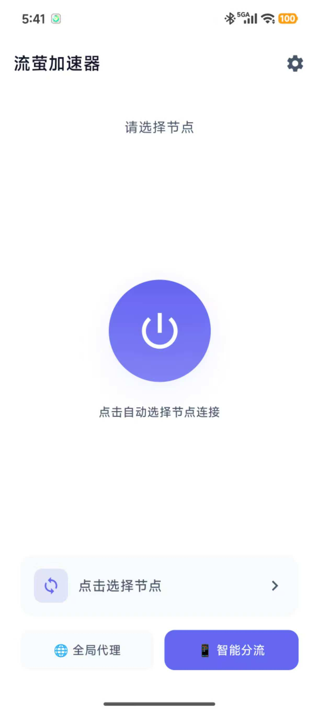
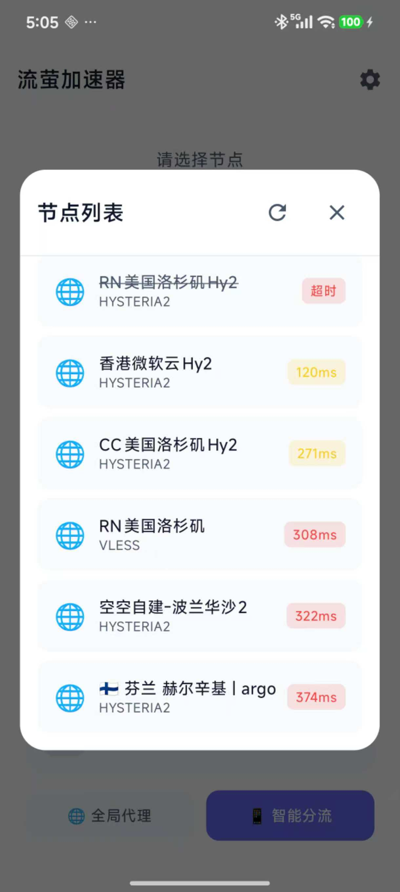

# 流萤加速器 (FireflyVPN)

<p align="center">
  
</p>


<p align="center">
  流萤加速器一款基于 sing-box 核心，支持多种代理协议和智能分流的 Android VPN 客户端。
</p>


<p align="center">
  <a href="#功能特性">功能特性</a> •
  <a href="#技术架构">技术架构</a> •
  <a href="#环境要求">环境要求</a> •
  <a href="#快速开始">快速开始</a> •
  <a href="#配置说明">配置说明</a> •
  <a href="#api-接口">API 接口</a> •
  <a href="#自定义">自定义</a> •
  <a href="#构建发布">构建发布</a>
</p>

---

## 界面展示

---

<div style="display:flex;gap:16px;flex-wrap:wrap;max-width:100%;"></div>

---

## 功能特性

- 🚀 **多协议支持**：VLESS、VMess、Trojan、Hysteria2、Shadowsocks、SOCKS5
- 🧭 **智能分流**：国内流量直连，国外流量代理，自动识别主流 CN 应用/CDN
- ⚡ **自动选择**：一键测速，自动选择最优节点
- 📦 **分应用代理**：精细控制哪些应用走代理或绕过 VPN
- 🌐 **绕过局域网**：一键开关，局域网流量直连不受影响
- 🚩 **智能国旗**：自动识别节点名称中的国旗 Emoji（如 🇫🇮），优雅展示
- 🔔 **公告系统**：支持远程推送公告通知
- 📦 **稳健更新**：
  - 应用内下载，支持断点续传
  - 原子化更新机制，杜绝安装包损坏
  - 智能权限引导，适配 Android 8.0+ 安装权限
- 🎨 **现代 UI**：基于 Jetpack Compose，Material Design 3 风格
- 🔧 **开源可定制**：易于修改 API、品牌和配置

---

## 技术架构

| 组件 | 技术 |
|------|------|
| **UI 框架** | Jetpack Compose + Material 3 |
| **架构模式** | MVVM (ViewModel + StateFlow) |
| **网络请求** | Retrofit2 + OkHttp3 |
| **本地存储** | Room Database + DataStore |
| **VPN 核心** | [sing-box](https://github.com/SagerNet/sing-box) (libbox.aar) |
| **并发处理** | Kotlin Coroutines |

---

## 环境要求

### 开发环境

| 工具 | 版本要求 |
|------|---------|
| **Android Studio** | Hedgehog (2023.1.1) 或更高 |
| **JDK** | 17 |
| **Kotlin** | 1.9.21 |
| **Gradle** | 8.2+ |
| **Android Gradle Plugin** | 8.2.2 |

### 运行环境

| 要求 | 说明 |
|------|------|
| **Android 版本** | Android 7.0 (API 24) 及以上 |
| **目标版本** | Android 14 (API 34) |

### 核心依赖

项目依赖 `libbox.aar`（sing-box Android 库），需放置于 `app/libs/` 目录。

> **获取 libbox.aar**：
>
> - 从 [sing-box Releases](https://github.com/SagerNet/sing-box/releases) 下载预编译版本
> - 或参考 [libbox 构建指南](https://sing-box.sagernet.org/installation/build-from-source/#build-libbox-for-android) 自行编译

---

## 快速开始

### 1. 克隆项目

```bash
git clone https://github.com/your-username/firefly-vpn.git
cd firefly-vpn
```

### 2. 配置 libbox

将 `libbox.aar` 文件放入 `app/libs/` 目录：

```
app/
└── libs/
    └── libbox.aar
```

### 3. 配置 API 地址

编辑 `app/src/main/java/xyz/a202132/app/AppConfig.kt`，修改为你的后端地址：

```kotlin
object AppConfig {
    // 节点订阅 API
    const val SUBSCRIPTION_URL = "https://your-server.com/api/nodes"
    // 版本更新 API
    const val UPDATE_URL = "https://your-server.com/api/update"
    // 公告通知 API
    const val NOTICE_URL = "https://your-server.com/api/notice"
    // 官网地址
    const val WEBSITE_URL = "https://your-server.com"
    // 反馈邮箱
    const val FEEDBACK_EMAIL = "support@your-domain.com"
}
```

同时修改 `app/src/main/java/xyz/a202132/app/network/NetworkClient.kt` 中的 baseUrl：

```kotlin
private val retrofit = Retrofit.Builder()
    .baseUrl("https://your-server.com/")  // 修改为你的域名
    // ...
```

同时修改 `app/src/main/res/xml/network_security_config.xml` ：

```kotlin
 <domain includeSubdomains="true">example.com</domain>// 修改为你的域名
```

### 4. 构建运行

```bash
# 使用 Gradle 构建
./gradlew assembleDebug

# 或在 Android Studio 中直接运行
```

---

## 配置说明

### 项目结构

```
app/src/main/java/xyz/a202132/app/
├── AppConfig.kt           # 全局配置常量（API地址等）
├── MainActivity.kt        # 主 Activity
├── VpnApplication.kt      # Application 类
├── data/
│   ├── model/             # 数据模型
│   │   ├── ApiModels.kt   # API 响应模型
│   │   ├── Node.kt        # 节点数据模型
│   │   ├── NodeType.kt    # 代理协议类型枚举
│   │   └── PerAppProxyMode.kt  # 分应用代理模式枚举
│   └── repository/        # 数据仓库
│       └── SettingsRepository.kt  # 设置存储（包含分应用代理、绕过局域网等）
├── network/
│   ├── ApiService.kt      # Retrofit API 接口定义
│   ├── NetworkClient.kt   # 网络客户端配置
│   ├── LatencyTester.kt   # 节点延迟测试
│   └── SubscriptionParser.kt  # 订阅链接解析器
├── service/
│   ├── BoxVpnService.kt   # VPN 服务（sing-box 核心）
│   └── ServiceManager.kt  # VPN 服务管理器
├── ui/
│   ├── components/        # 可复用 UI 组件
│   └── screens/
│       ├── MainScreen.kt  # 主界面
│       └── PerAppProxyScreen.kt  # 分应用代理设置界面
├── util/
│   └── SingBoxConfigGenerator.kt  # sing-box 配置生成器
└── viewmodel/
    ├── MainViewModel.kt   # 主界面 ViewModel
    └── PerAppProxyViewModel.kt  # 分应用代理 ViewModel
```

---

## 高级功能

### 分应用代理

分应用代理允许用户精细控制哪些应用走代理或绕过 VPN。

**功能特点**：
- 🟢 **代理模式**：只有选中的应用走代理，其他应用直连
- 🔴 **绕过模式**：选中的应用直连，其他应用走代理
- 🔍 **搜索过滤**：支持按应用名称或包名搜索
- 📂 **系统应用筛选**：可选择显示/隐藏系统应用

**设置位置**：侧边栏 → 分应用代理

---

### 绕过局域网

开启后，局域网流量将绕过 VPN 直连，确保内网设备访问正常。

**绕过的 IP 范围**：
| IP 段 | 说明 |
|--------|------|
| `127.0.0.0/8` | 本地回环 (localhost) |
| `10.0.0.0/8` | A类私有网络 |
| `172.16.0.0/12` | B类私有网络 |
| `192.168.0.0/16` | C类私有网络 |
| `169.254.0.0/16` | 链路本地地址 |

**设置位置**：侧边栏 → 绕过局域网（默认开启）

---

## API 接口

### 1. 节点订阅接口

**端点**: `GET /api/nodes`

**响应格式**: Base64 编码的节点链接列表（每行一个）

**支持的协议**:
- `vless://` - VLESS
- `vmess://` - VMess (Base64 JSON)
- `trojan://` - Trojan
- `hysteria2://` 或 `hy2://` - Hysteria2
- `ss://` - Shadowsocks
- `socks://` - SOCKS5

**示例响应** (Base64 解码后):
```
vless://uuid@server:443?security=reality&type=tcp&sni=example.com#节点名称
vmess://eyJ2IjoiMiIsInBzIjoi5ZCN56ewIiwiYWRkIjoic2VydmVyLmNvbSIsInBvcnQiOiI0NDMifQ==
trojan://password@server:443?sni=example.com#Trojan节点
ss://YWVzLTI1Ni1nY206cGFzc3dvcmQ=@server:8388#SS节点
```

**配置位置**: `AppConfig.kt` → `SUBSCRIPTION_URL`

---

### 2. 版本更新接口

**端点**: `GET /api/update`

**响应格式**: JSON

```json
{
    "version": "1.1.0",
    "versionCode": 2,
    "is_force":0,
    "downloadUrl": "https://your-server.com/download/app-v1.1.0.apk",
    "changelog": "1. 新增智能分流功能\n2. 修复已知问题"
}
```

**字段说明**:
| 字段 | 类型 | 说明 |
|------|------|------|
| `version` | String | 版本号（显示用） |
| `versionCode` | Int | 版本代码（用于比较） |
| is_force | Int | 是否强制更新（1为强制更新） |
| `downloadUrl` | String | APK 下载地址 |
| `changelog` | String | 更新日志 |

**配置位置**: `AppConfig.kt` → `UPDATE_URL`

---

### 3. 公告通知接口

**端点**: `GET /api/notice`

**响应格式**: JSON

```json
{
    "hasNotice": true,
    "title": "系统公告",
    "content": "服务器将于今晚 22:00 进行维护，届时可能无法连接。",
    "noticeId": "notice_20240117"
}
```

**字段说明**:
| 字段 | 类型 | 说明 |
|------|------|------|
| `hasNotice` | Boolean | 是否有公告 |
| `title` | String | 公告标题 |
| `content` | String | 公告内容 |
| `noticeId` | String | 公告唯一ID（用于去重） |

**配置位置**: `AppConfig.kt` → `NOTICE_URL`

---

## 自定义

### 修改应用名称

**文件**: `app/src/main/res/values/strings.xml`

```xml
<string name="app_name">你的应用名称</string>
<string name="vpn_notification_title">你的应用名称运行中</string>
```

**文件**: `app/ui/screens/MainScreen.kt`

```
text = "流萤加速器"; 替换成你的应用名称
```

---

### 修改应用图标

**图标文件位置**:
```
app/src/main/res/
├── drawable/
│   ├── ic_launcher_background.xml  # 图标背景
│   └── ic_launcher_foreground.xml  # 图标前景
├── mipmap-anydpi-v26/
│   ├── ic_launcher.xml             # 自适应图标配置
│   └── ic_launcher_round.xml       # 圆形图标配置
└── mipmap-*/                        # 各分辨率位图（可选）
```

**推荐方式**: 使用 Android Studio 的 **Image Asset Studio**
1. 右键 `res` → New → Image Asset
2. 选择 Launcher Icons
3. 配置前景/背景图像
4. 自动生成所有尺寸

---

### 修改应用包名

需要修改以下位置：

1. **`app/build.gradle.kts`**:
```kotlin
android {
    namespace = "com.your.package"
    defaultConfig {
        applicationId = "com.your.package"
    }
}
```

2. **`AndroidManifest.xml`**: 确保 package 声明正确

3. **源代码目录**: 重构 `app/src/main/java/xyz/a202132/app/` 为新包名路径

4. **所有 Kotlin 文件**: 更新 `package` 声明

---

### 修改主题颜色

**文件**: `app/src/main/res/values/themes.xml`

```xml
<style name="Theme.FireflyVPN" parent="android:Theme.Material.Light.NoActionBar">
    <item name="android:colorPrimary">@color/your_primary</item>
    <item name="android:colorAccent">@color/your_accent</item>
</style>
```

或在 Compose 主题文件中修改 Material 3 颜色方案。

---

### 修改智能分流规则

**文件**: `app/src/main/java/xyz/a202132/app/util/SingBoxConfigGenerator.kt`

在 `createDnsConfig()` 和 `createRoute()` 方法中修改 `domain_suffix` 列表：

```kotlin
add("domain_suffix", JsonArray().apply {
    add("cn")  // .cn 域名
    add("bilibili.com")
    add("taobao.com")
    // 添加更多域名...
})
```

---

## 构建发布

### Debug 构建

Debug 模式可直接构建，无需额外配置签名：

```bash
./gradlew assembleDebug
```

输出: `app/build/outputs/apk/debug/app-debug.apk`

### Release 构建

> ⚠️ **注意**: `keystore.properties` 和 `*.jks` 签名文件已被 `.gitignore` 忽略，构建 Release 版本需要你配置自己的签名。

1. **准备签名文件**:
   生成一个新的 `.jks` 签名文件（或使用现有的），放在项目根目录。

2. **创建配置文件**:
   在项目根目录创建 `keystore.properties` 文件：

```properties
keyAlias=你的KeyAlias
keyPassword=你的KeyPassword
storeFile=你的签名文件.jks
storePassword=你的StorePassword
```

3. **执行构建**:
```bash
./gradlew assembleRelease
# Windows PowerShell:
.\gradlew assembleRelease
```

**备选方法 (IDE 界面操作)**:
1. 菜单栏点击 **Build** -> **Generate Signed Bundle / APK**
2. 选择 **APK** -> **Next**
3. 选择密钥库并输入密码
4. 选择 **release** -> **Create**

输出: `app/build/outputs/apk/release/app-release.apk`

---

## 常见问题

### Q: 启动时报 `unknown field "rule_set"` 错误
**A**: 当前 libbox 版本不支持 `rule_set` 特性。项目已使用硬编码的 `domain_suffix` 规则代替，请确保使用最新代码。

### Q: 节点无法连接 / NAME_NOT_RESOLVED
**A**: 域名类节点（如 Trojan）需要通过本地 DNS 解析。代码已自动处理节点域名白名单，请确保使用最新版本。

### Q: 如何添加新的代理协议？
**A**:
1. 在 `NodeType.kt` 添加新枚举值
2. 在 `SubscriptionParser.kt` 添加解析逻辑
3. 在 `SingBoxConfigGenerator.kt` 添加 outbound 生成逻辑

---

## 开源协议

本项目基于 [MIT License](LICENSE) 开源。

**依赖项目**:
- [sing-box](https://github.com/SagerNet/sing-box) - GPLv3

---

## 致谢

- [SagerNet/sing-box](https://github.com/SagerNet/sing-box) - VPN 核心
- [JetBrains/Kotlin](https://github.com/JetBrains/kotlin) - Kotlin 语言
- [Google/Jetpack Compose](https://developer.android.com/jetpack/compose) - UI 框架
